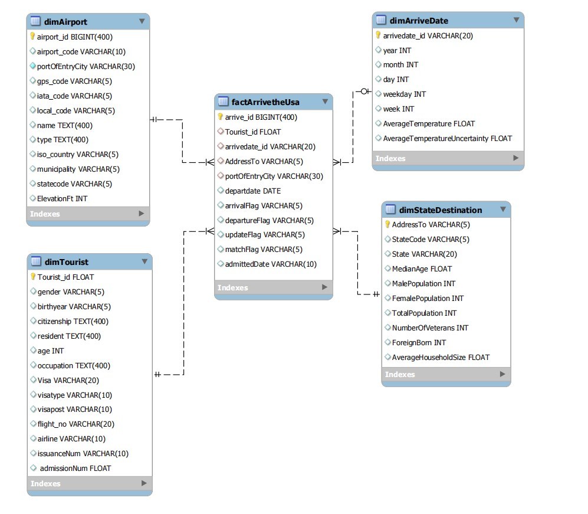
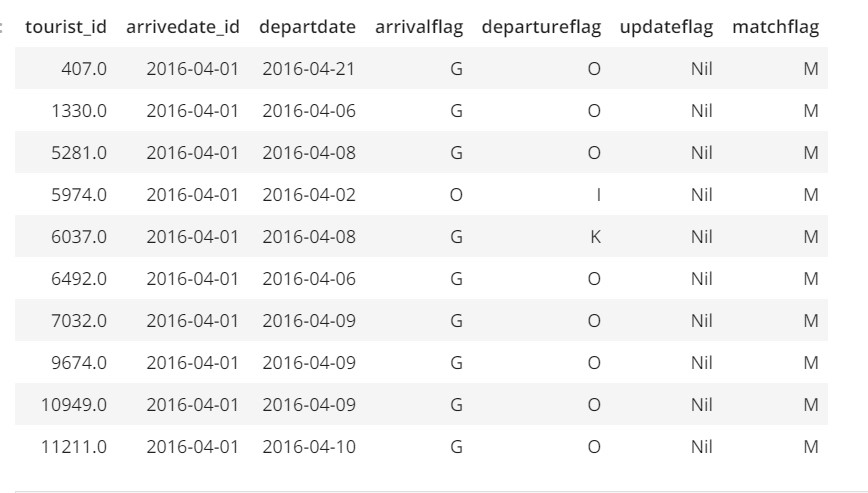
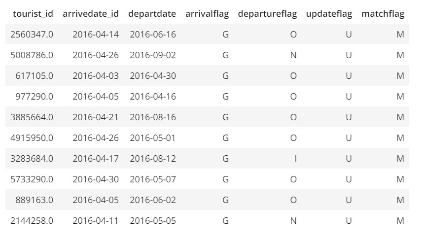

#### Scope of this project

This project uses the four dataset provided by Udacity, which are 

- An immigration dataset of travellers arriving the United State of America by air, sea or road.
- An airport dataset of various airports in the United State with it's codes, names , type e.t.c
- A population demography dataset of various cities in the United State.
- A temperature dataset of daily temperature measured for various states.

Analytical schema



The Analytical Data model contains a fact table of the event, which is arrriving the USA. And also some dimension tables to provide context on the event. The dimension table ought to provide broader context of the events in the fact table. The Tourist dimension table provides information used to identify the tourist, The State destination dimension table provides information on the state to which the tourist will be living in the USA, this could be drilled down to the city if it was provided in the immigration data, but for security purpose it wasn't. The Airport dimension table provides information on the airport on arrival, which could be useful for further security checks on the tourist. The arrive date dimension table provides information on the time of arrival and also includes the average temperature on the day of arrival. The fact table provides information which includes arrival flag, departure flag, update flag if the tourist has extended his stay beyond the departure date, and match flag to match his arrival date and departure date. Since this analytical schema is designed for surveillance, the flags are the key metrics. Other purposes can also be achieved with this schema.
 

## Files in the repository

- The Capstone Project Template.ipynb files contains all the processing done, the exploration of data, model development, pipelines, data quality checks and project write-up.

- The start_redshift.py file first reads configuration variables from a configuration file (dl.cfg).This start_redshift.py file contains a function that creates an identity and access management (iam) role using the aws account owner access key and secret key, and a function that creates a redshift cluster with thesame user authentication credentials and applies the created iam role to the cluster, and another function that uses an EC2 VPC (Virtual Private Cloud) to allow external communication to the redshift cluster. Finally, it writes the redshift endpoint and roleArn to the dl.cfg configuration file.
 
- The drop_redshift.py file first reads configuration variables from a configuration file (dl.cfg) and it has a main function that deletes the created redshift cluster and also detaches the role policy before deleting the role.
 
- The sql_queries.py file contains all the sql query for dropping pre-existing tables, creating required tables,coping data to redshift cluster, inserting data from staging tables into analytical tables and quality checks queries. All the queries are assigned to variables and the variables are imported into required files.

- The create_table.py file contains function use to establish connection to the redshift cluster, drop all existing tables in the database and also create all required tables.Finally, it closes connection to the database.

- The warehouse.py file contains function that extracts data from the S3 bucket and copies this data into staging tables in the redshift cluster. And another function that extracts data from the staging tables, transforms it and loads it into the created analytical tables in the database. Finally, it closes connection to the database.

- The geocoded_data.ipynb files contains processing done to add a geocode column to the airport dataset using the OpenStreetMap Nominatum geocoding service.

- The spark.py file contains datalake transformation and loading done, to load cleaned-up datasets into AWS S3 storage as parquet file. 

- The variable2.py file contains encoded variables used in the datalake processing.

- The quality_check.py file contains functions used to run quality checks on the database.

- The test_quality.py file is a Pytest used file, that is used to run test on python functions, scripts e.t.c.

- The dl.cfg file contains configuration variables used in the files above

- The example.ipynb file contains some example queries done on the database to provide analytical insight on the use case of this project.
            
## How to run this python scripts

To run this script, first provide your aws access key and secret key to the dl.cfg file, then run the start_redshift.py file to create the redshift cluster, then run the create_table.py file to initialise the database. This file should be run only once before the warehouse.py file, as it contains script to delete pre-existing tables in the database.<br>
After this, run the warehouse.py file to extract data from S3 bucket to redshift staging tables, and from staging tables to analytical tables. With this done, the analytical queries can be performed on the database to get analytical insight. The example.ipynb file can be use for more analytical queries on the database.<br>
**After the analytical queries, run the drop_redshift.py file to drop all aws resources. cost attached**

###  Example queries.The queries are executed on the example.ipynb file. 

> Tourist who arrived the USA in the month 0f Apri 2016 and their flags?

```
  %sql SELECT D.Tourist_id,F.arrivedate_id,F.departdate,F.arrivalFlag,F.departureFlag,F.updateFlag,F.matchFlag FROM ((factArrivetheUsa F JOIN dimTourist D \
            ON F.Tourist_id = D.Tourist_id) \
            JOIN dimArriveDate A ON A.arrivedate_id = F.arrivedate_id) \
            WHERE CAST(F.arrivedate_id AS date) < F.departdate AND A.year =2016 AND A.month = 4 LIMIT 10;
```


> Tourist who arrived the USA in the month 0f Apri 2016 and has updated flag?

```
  %sql SELECT D.Tourist_id,F.arrivedate_id,F.departdate,F.arrivalFlag,F.departureFlag,F.updateFlag,F.matchFlag FROM ((factArrivetheUsa F JOIN dimTourist D \
            ON F.Tourist_id = D.Tourist_id) \
            JOIN dimArriveDate A ON A.arrivedate_id = F.arrivedate_id) \
            WHERE CAST(F.arrivedate_id AS date) < F.departdate AND F.updateFlag != 'Nil' AND A.year =2016 AND A.month = 4 LIMIT 10;
```            
            

            
**Note the flags symbols has special meaning which were not provided in the dataset**            
  


